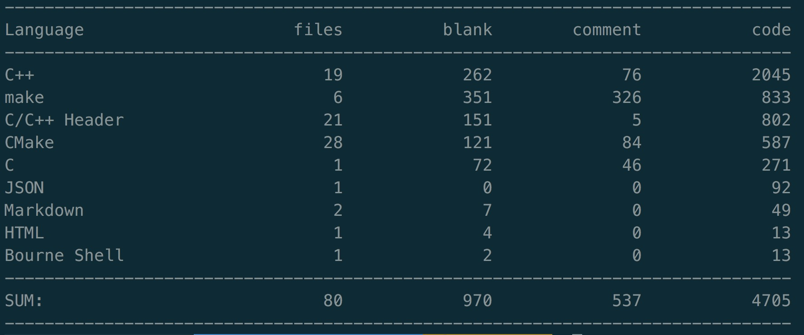

# Deon
[](https://travis-ci.org/Answerhua/deon)  
[](https://opensource.org/licenses/mit-license.php)  

Deon是一款高性能，基于c++11的多线程服务器,可处理静态资源，可以解析get、head请求。
## Envoirment
- 操作系统
	- Unbuntu 14.04 and above
	- CentOS 7 and above
- 编译环境
	- g++ 4.8

## Build and Start
```
$ ./build.sh
$ cd build/release/deon
$ ./deon -r ../../../test
```

## Parameter
| 参数 			| 作用 		|
| ----------- | ------ 	|
| -t			| 线程数量	|
| -p			| 端口号	|
| -l			| 日志路径	|
| -r            | 根目录位置|
| -h			| 使用方法	|
| -v 			| 版本号	|

## Feature
- Epoll + 非阻塞I/O + 线程池，基于Reactor模式
- 使用基于小根堆的定时器，处理超时请求
- 使用基于双缓冲技术的异步日志系统
- 使用状态机的方式，解析HTTP请求
- 使用智能指针等RAII机制
- 使用eventfd进行线程唤醒
- 支持长连接，支持优雅关闭连接


## First commit cloc

