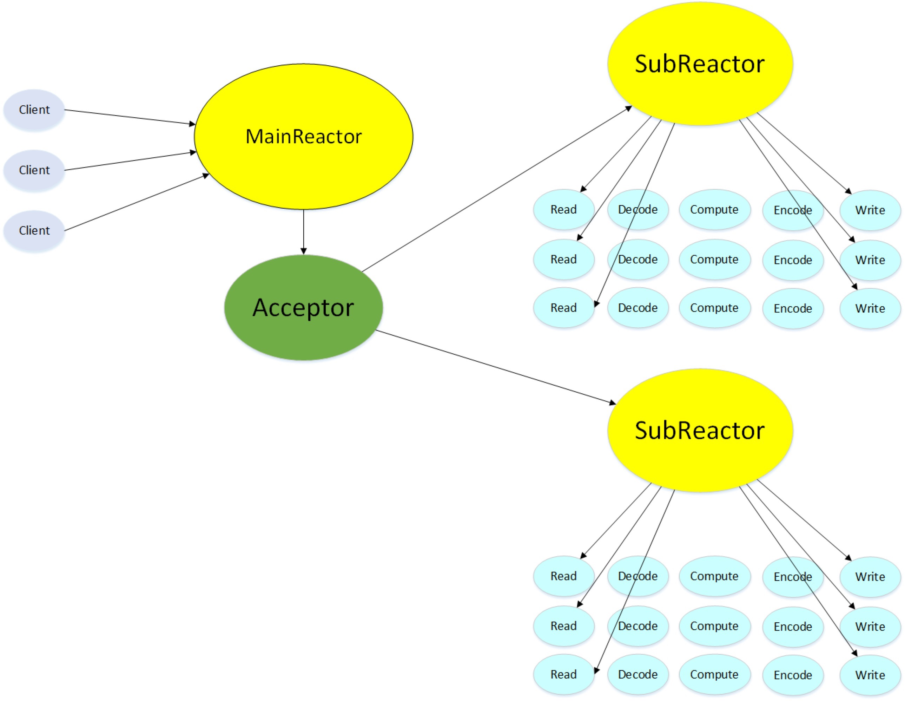

## Model
基本架构为epoll + 非阻塞I/O + 线程池，使用Reactor模式。每个线程一个事件循环，遵循One loop per thread。

- epoll
	- 触发方式
		- 采用的为ET模式(边缘触发)，不同于LT(水平触发)，ET模式对编程提出了更重要的要求。每次读，需要一直读,直到读到EAGAIN。每次写，需要一直写，直到写到EAGAIN。
	- 为什么ET模式下建议使用非阻塞I/O
		- ET模式下，如果使用阻塞I/O。对于读，一般程序会循环读取socket，这个循环势必会在最后一次没有数据读的时候，一直阻塞下去。对于写，socket的unwritable / writable 状态变化没有任何意义。因为总是会阻塞直到所有数据全部发出。
- 线程池
	- 作用
		- 通过多线程提高并发性
		- 避免线程频繁创建和销毁所带来的开销

## Reactor parttern

MainReactor只有一个，只是负责响应client的连接请求，并将连接请求通过循环制(Round-robin)的方式，分发给SubReactor。  
每个SubReactor都会维护一个多路复用选择器，并能够同时维护多个client请求。

## Class
**EventLoop类**：相当于One loop per thread中的loop，即一个线程维护一个EventLoop对象。扮演着Reactor parttern中Reactor的角色。   
 
- 主要作用
	- 每次从epoll_wait中获取活跃的事件，并分发到相应的Channel中，执行回调函数。
	- 处理超时请求(执行定时器的工作)。

**Channel类**：相当于Reactor下的事件，并自始至终属于同个EventLoop。一个Channel对应一个文件描述符。

- 主要作用
	- 保存I/O事件所对应的回调函数。
	- 当I/O事件发生时，调用相对应的回调函数。

## Timer
- 数据结构
	- 使用的stl中的priority_queue，其底层实现为小根堆。
- 删除策略
	- 惰性删除
		- 不会在时间到了的时候立马删除，而是在检查的时候，删除超时请求。
- 设计思路
	- 顺序访问优先队列，若节点超时，则将其删除。因此一个节点被删除需要同时满足两个条件(1)该节点超时 (2)该节点前面的节点都被删除。
	
